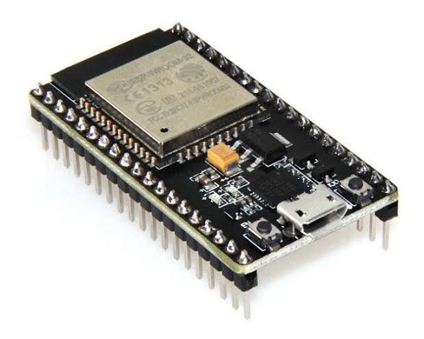
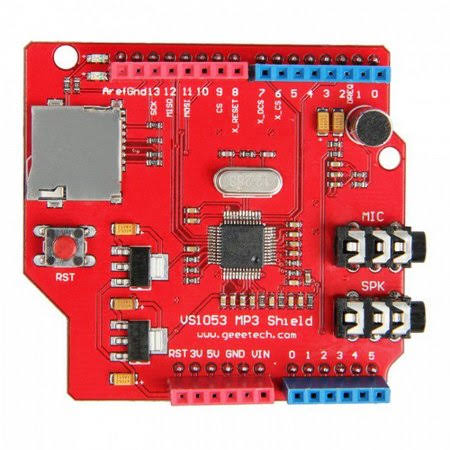

# Aula 1 - Arduino, tipos, instalação da IDE

## Conteúdo

Nesse semestre faremos alguns projetos com arduino que nos fornece um ambiente completo para trabalhar com microcontroladores, ele eh um projeto opensource feito por uma empresa italina, mas hoje ja temos outras fabricamentes no mercado que fazem placas similares ja que os modelos de hardware sao abertos e podem ser copiados sem maiores implicacoes. Um arduino não é simplesmente um micro-controlador, ele é uma placa de desenvolvimento que tem um micro-controlador e algumas outras peças que facilitam nosso trabalho, para programar micro-controladores "na mão" é bem mais complexo, pois precisamos geralmente montar um cirucuito e ter algumas ferramentas mais especificas, e o arduino facilita isso para nós.

Sem o arduino:

Com arduino:

O Arduino pode ser alimentado por uma fonte de 9v ou um cabo serial-usb(brotip: muitas impressoras usam esse cabo). Durante a realizacao de algum projeto precisamos trocar dadis entre o arduino e o computador, para isso, fazemos o uso do cabo serial. A fonte ou bateria de 9v sera usada para o funcionamento do projeto ja realizado(quando nao precisamos trocar dados).
O Arduino usa C++ como linguagem padrão, mas existem alternativas(como por exemplo, python, ADA, basic, entre outros...), porém elas sao menos documentadas e a comunidade nao eh tao grande, e podem nao ser tao performaticas, entao talvez voce tenha alguma dificuldade, por isso focaremos no C++!

O arduino tem alguns pinos(a quantidade muda de acordo com o modelo), esses pinos servem para fazer conexões baseadas em input e output.

* `Pinos analógicos`: são prefixados com um `A` maiusculo, ex: `A1`, onde os valores de suas medicoes podem variar de 0 a 1023, ou seja um numero de 10 bit;

* `pinos digitais`: são representados apenas por números, ex: `13`, e os valores de medicao sao binarios(0 e 1);

* `pinos PWM`: pinos prefixados com `~`  sao pinos digitais que simulam um sinal analógico(veremos mais sobre isso na aula de eletronica basica);

* `pinos de alimentação`: Podemos alimentar nosso circuito ou senssores com `3.3v`, `5v` ou `Vin` que tem basicamente a mesma tensao de entrada do arduino(um pouco menos de 9v) e o pino `GND`(Ground) que eh o terra.

* `pinos RX e TX`: servem para receber e enviar dados via serial

 Tambem temos [outros](https://www.arduino.cc/en/reference/board) pinos que veremos no decorrer das atividades mas nao sao tao utilizados.

Esse eh o esquema de pinagem do arduino uno:

Temos uma gama enorme de modelos dispoíveis, entre eles muitos que não são da empresa Arduino propriamente dito. Na sequencia veremos alguns modelos e suas caracteristicas:

* `Arduino Uno` - O mais conhecido de todos, ele é um modelo bem simples e barato, e muito indicado para quem está começando, porém não tem muitos recursos especiais mas tem uma quantia razoavel de pinos, nos usaremos ele em quase todos nossos projetos. Ele usa o microcontrolador ATmega328 que eh produzido pela Atmel, ele opera na frequencia de 16MHz, ele conta com 14 pinos de entrada e saida(input e output), e 6 desses pinos podem ser usados para PWM(pulse width modulation) e do outro lado temos 6 pinos analógicos. Ele tem 32KiB de memoria flash aonde os programas sao armazenados, e tem 2KiB de RAM.
AVISO: Cuidado ao ligar sensores de 3.3v nos pinos de input e output, ja que esses pinos operam com 5v e voce pode danificar alguma coisa.
Temos dois tipos dispoíveis desse modelo, os que sao PTH(plate through hole) que voce pode remover o microcontrolador, e o SMD(surface mount device) que tem o microcontrolador soldado na placa, mas ambos funcionam da mesma maneira.

* `Arduino pro mini` - Esse modelo eh bem conhecido pelo seu tamanho, são bem pequenos e geralemnte usados para projetos mais discretos, como o Rubber Ducky, teclados mecânicos, etc. Ele tem versoes de 3.3v e 5v, sendo que o de 3.3v opera na frequencia de 8MHz, e o de 5v com 16MHz. Vale salientar que ele nao tem as entradas femeas, o que significa que voce precisara soldar algumas coisas, e tambem nao tem usb, entao para programa-lo voce precisara de um FTDI ou cabo serial.

* `Arduino pro micro` - Esse modelo lembra bastante o Arduino pro mini, porem tem suporte a USB, oque facilita nosso trabalho ja que nao precisaremos de nenhum cabo especial para programa-lo. E ele tambem usa outro chip, o ATmega32U4. Ele tem 12 pinos de IO, 5 sao PWM, 4 sao analogicos, e ele conta com 32KiB de memoria flash, e 2.5KiB de RAM.
E como o pro mini ele tem versoes de 3.3v e 5v.

* `Arduino Mega 2560` - Um dos maiores modelos dispoíveis, esse modelo é muito usado em impressoras 3D, cortadoras a laser e CNC's. Ele opera com 16MHz, tem 54 pinos de IO, 15 desses sao PWM, 16 pinos analogicos, incriveis 256KiB de memoria flash, e 8KiB de RAM e 4 portas seriais.

* `Esp8266` - Esse modelo não eh da empresa Arduino, ele se destaca por seu tamanho pequeno e pela quantidade enorme de recursos que já vem embutidas e não precisam ser compradas a parte, como o módulo de wifi, 520 KiB SRAM de memória(o que é mais que alguns arduinos), porém o upload do código para a placa é um pouco mais chatinho e algumas coisas funcionam um pouco diferente de arduinos convencionais, então sempre que usar um ESP verifique se a lib que tu usará suporta o seu dispositivo. E ele opera com 3.3v na frequencia de 80 MHz.

* `Esp32` - Esse eh o sucessor do ESP8266, ele ja vem com suporte a bluetooth e BLE(versao mais nova do bluetooth que gasta menos energia), ele tem 520 KiB menoria flash, uma coisa bacana desse dispositivo eh que ele tem duas versoes de processadores disponiveis, 32-bit LX6 microprocessor que tem apenas um core como as outras placas vistas antes, e um com o microprocessador Xtensa dual-core, que tem mais poder de processamento e abre portas para coisas muito legais, como realizar operacoes em paralelo.

* `SHIELDS`: são módulos que se conectam ao arduino para fazer algo de maneira facil sem que voce tenha que montar um cirucuito completo, como por exemplo:

 - controlar um motor:

 - usar um chip de celular no seu projeto(GPRS):

 

 - modulos MP3 para musicas:

 

 - E muitos outros...

 

Primeiro instale ela em sua máquina, acesse [esse link](https://www.arduino.cc/en/main/software) e faça o download de acordo com seu sistema operacional.

Agora que já entendemos o básico do funcionamento do arduino vamos falar um pouco sobre a IDE(Integrated Development Environment) do Arduino. Uma IDE nos oferece todo um ambiente de desenvolvimento onde podemos compilar e enviar nosso codigo, debugar possiveis problemas, encontrar exemplos que nos ajudam a criar nossos projetos servindo como inspiracao e base, entre muitas outras ferramentas que acabam facilitando nosso trabalho, entre elas podemos citar algumas das principais funções:

* File -> Examples: Possui diversos exemplos para se inspirar.

* Sketch -> Add library: Instalar uma lib na sua máquina.

* Tools -> Board: Para escolher qual placa você está usando.

* Tools -> Serial Port: Escolhe a porta usb do computador que está ligado a porta serial do arduino, no linux o padrão de nomenclatura para esse dispositivo é algo assim: `dev/ttyACM0`, e para windows `COM1`.

* Tools -> Auto Format: Identa seu código corretamente.

* Botão verify: Compila seu código para saber se tem algum erro mas não envia para a placa.

* Botão upload: Compila seu código e envia para a placa.

Apos fazer o upload de um codigo podemos acompanhar a comunicacao que acontece usando o monitor de porta serial que nos mostra as informacoes em formato numerico/texto ou o serial plotter, que exibe os mesmos dados em forma de grafico.

Monitor serial:

Serial plotter:

## Desafio

### User history

Seu treinamento comecou hoje e apos a apresentacao inicial do arduino, como muitas pessoas foram contratadas pela ACME recentemente, foi pedido que se organizassem em squads para a realizacao dos projetos durante o ano, entao junte seu time e podemos comecar!

### Tasklist

* [ ] Montar squad
* [ ] Criar um canal de comunicacao

## Referencias e recursos uteis

[Site oficial do arduino](arduino.cc/)

[Esquema eletrico do arduino](https://www.arduino.cc/en/uploads/Main/arduino-uno-schematic.pdf)

[Arduino Download](https://www.arduino.cc/en/Main/Software)

[Pinagem do arduino](https://www.arduino.cc/en/reference/board)

[Comparacao de modelos de arduino da sparkfun](https://www.youtube.com/watch?v=hjRSwBcLcSU)
