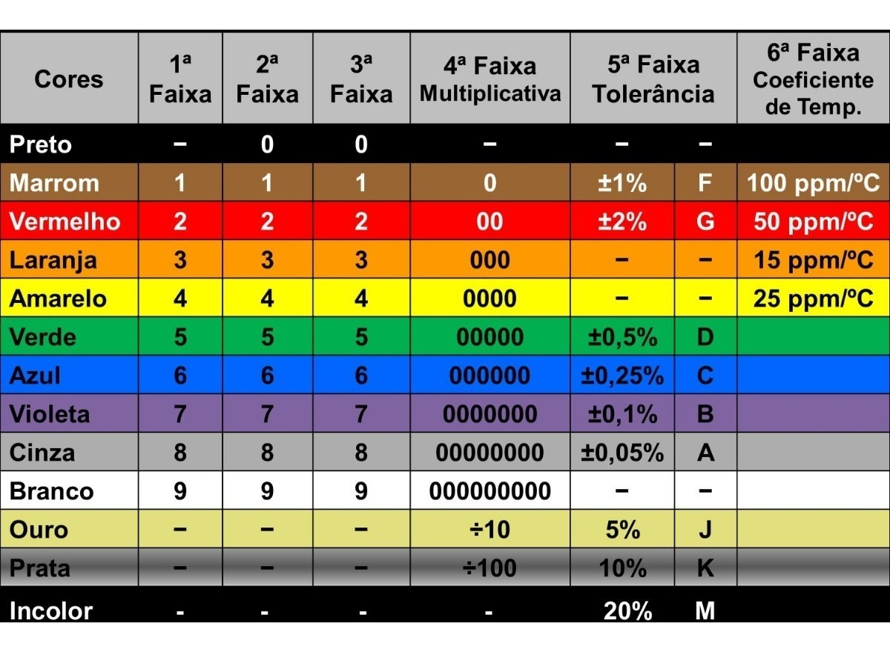
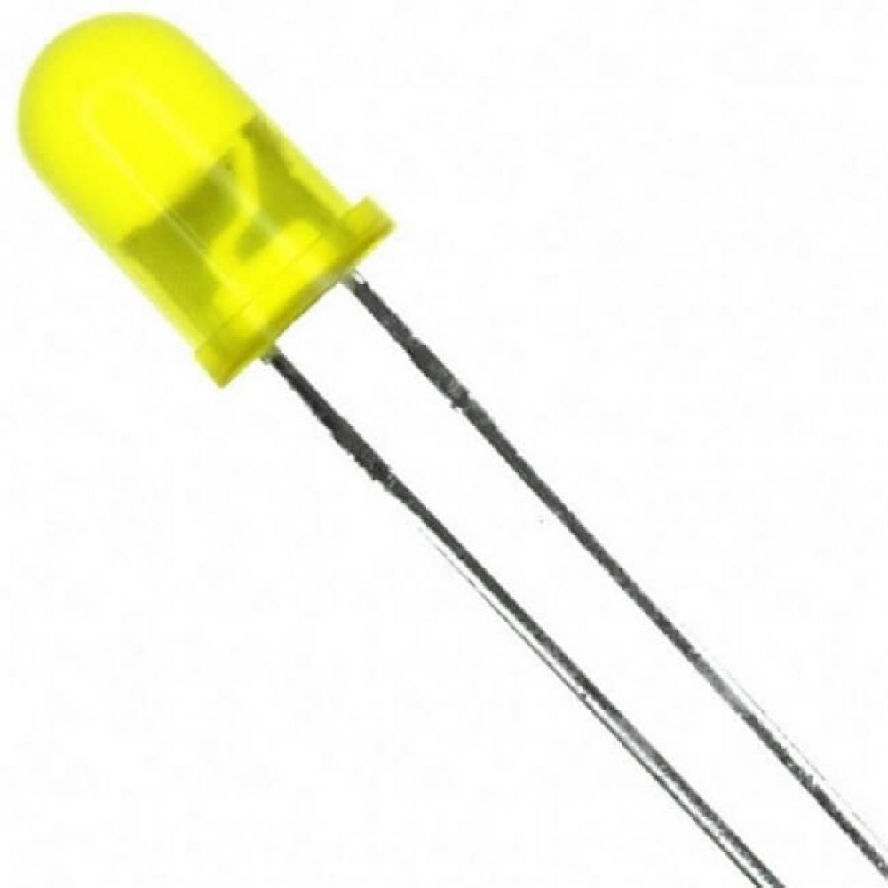
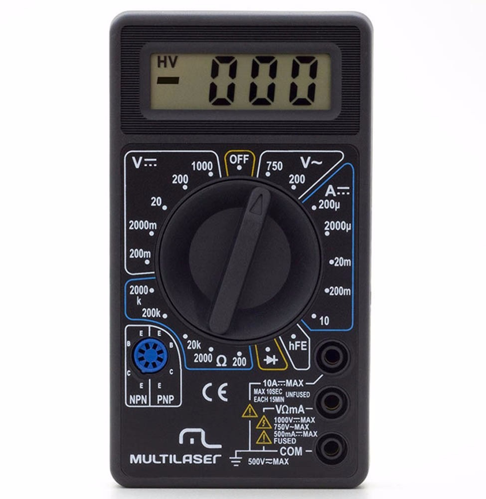

# Aula 3 - Eletrônica básica.

## ELETRÔNICA VS ELÉTRICA

Nessa aula falaremos um pouco sobre eletrônica básica, mas primeiro vamos entender a diferença entre eletronica e eletrica. Quando nos referimos a eletrônica falamos de circuitos de baixa tensão geralmente, como microcontroladores, celulares, dispositivos eletrônicos pequenos entre outros. Já elétrica geralmente lida com tensões mais altas, como as que tem nas tomadas, fios de poste, microondas, etc. Porém muitas regras se aplicam para ambos os campos de estudo, mas nosso enfoque aqui será na parte eletrônica.

Quando falamos de uma fonte de alimentação elétrica temos duas opções `VCA` e `VCC`, VCA significa voltagem em corrente alternada e VCC voltagem em corrente contínua, o tipo de corrente alternada foi proposta pelo brilhante Nikola Tesla após trabalhar um período com Thomas Edison para criar uma solução que fosse capaz de levar energia para as cidades, na época tinha apenas a corrente contínua de Edison, que não era eficiente em termos de ser transportada para lugares afastados, o que precisaria de pelo menos uma usina a cada quilômetro para cobrir todo o USA, pois havia muita perda de energia. Tesla criou então a corrente alternada, que é super efetiva para transportar energia em longas distâncias, que é o padrão que usamos até hoje em dia na maior parte do mundo. Porém essa energia muitas vezes ao chegar a seus dispositivo é convertida para corrente contínua. Esse episodio da historia foi conhecido como a guerra das correntes.

A diferença científica entre os dois tipos de corrente são como os elétrons se movem dentro do material condutor, na corrente contínua eles se movem simultaneamente na mesma direção, de forma contínua. Enquanto na corrente alternada ele se move para frente e para trás, o que faz os elétrons sofrem menos resistência e poderem enviar mais energia com menos perda e cabos mais finos.

## Lei de Ohm

A lei de Ohm define como algumas grandezas elétricas se comportam, vamos entender cada uma delas, mas antes vamos relembrar como a eletricidade funciona, os átomos têm um núcleo, elétrons que são cargas negativas, nêutrons que como o nome diz são neutros, e os prótons, que contém carga negativa. Quando dois átomos com cargas diferentes se aproximam eles tendem a trocar as cargas para se equilibrar, essa passagem dos elétrons cria a energia elétrica.

* `Corrente`: É medida em Amperes, a corrente é basicamente a quantidade de cargas positivas passando em um lugar em um certo instante, a corrente se move no lado oposto aos elétrons. Podemos calcular a corrente usando `i = u/r`.

* `Tensão`: É medida em Volts, a tensão é a força que faz os elétrons se moverem, essa tendência que os átomos tem a se equilibrar se dá por uma coisa chamada diferença de potencial, ou tensão. Quando temos dois átomos com potenciais energéticos diferentes ocorre uma descarga de elétrons que gera uma corrente. Podemos calcular a tensão usando `u = r*i`.

* `Resistência`: Todo material oferece uma certa resistência Podemos calcular a resistência usando. Quanto mais resistente um material for menos corrente passará por ele, materiais que não oferecem resistência são chamados de condutores, os que oferecem uma resistência baixa são chamados de de semicondutores, e os que têm uma resistência muito alta como o plástico utilizado para encapar fios por exemplo são chamados de isolantes. Podemos calcular a resistência usando a seguinte fórmula: `r = u/i`.

Como devem ter reparado, podemos calcular os 3 com a mesma fórmula, o triângulo uri.

Outra coisa importante é a `referência` de um circuito. Quando temos mais de um tipo de alimentação no nosso circuito, é importante juntarmos os grounds, para que todo o circuito tenha a mesma referência do que é 0v. Sem isso o circuito não funcionará corretamente. Porém falaremos desse assunto com mais detalhes quando falarmos de projetos com alimentação externa.

## PWM

Quando queremos controlar a tensão de um circuito podemos fazer isso de algumas maneiras, as principais soluções seriam colocar um potenciometro, que nada mais é do que uma resistência de valor variável, que seria uma solucao analogica, ou podemos usar o PWM, que seria a maneira digital de fazer isso, Pulse width modulation, ou pulso por tamanho de modulação é uma técnica que usamos para simular esse comportamento do potenciômetro de maneira digital. Imagine que você queira enviar uma tensão de 4v, porém ao enviar um sinal digital HIGH, você envia 5v. A solução é enviar em 1s 80% do tempo HIGH, e 20% do tempo LOW, se calcularmos 80% de 5, chegaremos ao resultado 4. A ideia de controlar o tempo dos ciclos nos ajuda quando precisamos controlar a tensão de algum circuito mas não queremos adicionar um potenciômetro.

O potenciômetro é bom para quando temos algo que consome mais energia, como uma linha de leds, ou até mesmo um ventilador. Porém para coisas menores, e principalmente quando são alimentadas por baterias, nossa preferência é usar PWM, pois como temos menos resistência, menos energia é perdida durante o caminho.

## Componentes eletrônicos

Para montar nossos circuitos temos diversos dispositivo básicos que são usados em diferentes projetos, essas peças essenciais para a montagem de um circuito se chamam componentes elétricos, cada um deles tem uma função, abaixo falaremos em detalhes sobre alguns deles que usaremos mais em nossos projetos, porém existem outros porém agora vamos nos preocupar com esses que serão os mais utilizados:

* `resistor`: É um componente feito de um material resistivo, ou seja, ele oferece mais resistência, o que faz ele perder um pouco de energia no caminho, essa energia na verdade não se perde, se transforma em calor. Os resistores são medidos em OHM. E para indicar qual o valor do resistor é utilizado uma ordem de cores, mas não se preocupe em decorar todas, temos tabelas e calculadoras para facilitar nosso trabalho. Apenas um lembrete, para ver o código de cores de um resistor sempre posicione a fita prata/dourada ao lado direito.

* `capacitor`: Um capacitor serve como uma bateria para armazenar energia, porém ela diferentemente da bateria descarrega quase que instantaneamente, a unidade de medição para o quanto de energia um capacitor pode armazenar é chamada de Farad.

* `diodo`: Um diodo serve para impedir que a corrente elétrica passe por algum lugar que você não queira, imagine ele como um bloqueador que permite a passagem de energia em uma direção apenas. O diodo mais conhecido é o LED, que é um tipo de diodo que emite luz(Light-Emitting Diode).

* `CI`: CI ou Circuito Integrado são pequenos chips com circuitos prontos dentro deles que fazem alguma coisa em específico, o bacana desses chips é que eles revolucionaram a eletrônica e a computação permitindo cada vez circuitos mais complexos utilizando menos espaço.

* `rele`: Rele ou relé um interruptor eletromecânico, a movimentação física deste interruptor ocorre quando a corrente elétrica percorre as espiras da bobina do relé, criando assim um campo magnético que por sua vez atrai a alavanca responsável pela mudança do estado dos contatos. Com isso conseguimos ativar e desativar a alimentação energética de algum circuito, esse componente é muito usado para ligar e desligar motores, fechaduras, etc.

* `protoboards`: Protoboards ou uma placa de ensaio, é uma placa com vários furos, com ela podemos montar nossos protótipos sem ter que soldar tudo, as linhas são integradas horizontalmente e verticalmente.

* `jumpers`: São "cabinhos" para realizar as conexões entre sensores, atuadores, etc. Temos jumpers MF, FF e MM.

## Multimetro

Uma ferramenta muito importante de aprendermos a usar é o multímetro, ele nos ajudará a entender alguns cenários e nos dar a segurança que precisamos para fazer nossos projetos sem medo de queimá-los por falta de medições.
O multímetro é dividido em algumas partes(podem ter variações):

* `Pontas de teste`: Um conjunto de fios com conectores, geralmente com a cor preta e vermelha, sendo o preto usado para o groud e o vermelho para vcc/vca.

* `Borne`: São entradas para conectar as pontas de teste. Temos as seguintes entradas:

  - `COM`: ground

  - `VΩmA`: Este borne é o que usamos geralmente, ele mede tensão, resistência e corrente em microamperes.

  - `10A-MAX`: Quando precisamos medir correntes até 10A, porém esse é um valor muito alto e para nosso uso ele não será utilizado.

* `Chave seletora`: Na chave seletora podemos escolher qual tipo de grandeza vamos medir. Temos as seguintes opções geralmente:

  - `V-`: Corrente contínua.

  - `V~`: Corrente alternada.

  - `Ω`: Resistência.

  Acima temos as três principais medições, porém também podemos ver outras coisas interessantes:

  - `->|-`: Esse sinal pode parecer uma seta com um traço, ou um símbolo de sinal, serve para medirmos a continuidade de um circuito, ou seja, vemos se a eletricidade pode passar por certo lugar ou nao, isso é muito útil para testar fios, circuitos, etc...

  - `_|-|-_|_`: Sinal de uma onda quadrada, serve para analisarmos a sinais enviados por algum fio, imagine uma transmissão de um cabo de rede, ele basicamente envia vários 0's e 1's, uma maneira de analisar isso seria medindo os fios de TX e RX. Porém é difícil entender bem o que está acontecendo, isso serve mais para uma identificação, para entender a lógica de um circuito mesmo existem ferramentas mais avançadas como osciloscópios e muitos outros.

IMPORTANTE: Sempre que for usar o multímetro e nao souber o quanto de energia você está lidando, comece sempre com a chave seletora nos valores maiores e vá diminuindo até chegar em uma medição que faça sentido, senão você pode queimar o multímetro ou até algo a mais se por exemplo colocar para medir 200v e o conectar em uma tomada de 220v.

Caso queira medir a corrente é importante fazer com que o seu multímetro faça parte do circuito.

# Desafio

### User story

Seu squad está fazendo estudos sobre eletrônica nesta semana e você recebeu alguns resistores, uma fonte e um arduino, foi pedido para que você analisasse os valores dos componentes utilizando um multímetro.

### Tasklist

* [ ] Medir a resistência dos dois resistores apresentados.

* [ ] Medir a tensão de alimentação do arduino e dizer qual é o polo positivo e qual o negativo.

* [ ] Medir a tensao de alimentacao do led e dizer qual é o polo positivo e qual o negativo.

* [ ] Medir a corrente passando pelo led.

* [ ] Verificar a continuidade do um circuito apresentado.

## Referências e recursos úteis

[Guerra das correntes](https://pt.wikipedia.org/wiki/Guerra_das_Correntes)

[Lei de Ohm](https://brasilescola.uol.com.br/fisica/a-lei-ohm.htm)

[Explicacao detalhada sobre PWM](http://www.mecaweb.com.br/eletronica/content/e_pwm)
