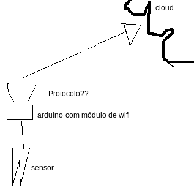

# Aula 1 - Introdução ao raspberry pi e dispositivos de borda.

## Conteúdo

Nessa aula falaremos um pouco sobre dispositivos de borda e o modelo arquitetural.

Atualmente os dispositivos de borda tem se tornados mais comuns a cada dia, com o crescimento das clouds, surge uma nova nessecidade, a aquitetura tradicional tinha apenas um client e um backend, o client simplesmente jogava a informação para o backend e o mesmo cuidava de todo processamento. Porém em um cenário real de uma aplicação em produção, muitas vezes a cloud acaba sendo onerada pelas requisições cheias de dados "sujos" da internet.
Para solucionar esse problema usamos a arquitetura de dispositivos de borda, aonde colocamos um "intermediário" entre as duas partes. Esse dispositivo pode ter diversas funções, mas o principal é receber os dados de um client e limpar, filtrar, e pre-processá-los para passar para o backend apenas o que realmente importa.

Imagine um caso aonde temos um sensor enviando 100 medições por segundo para a cloud, e lá essas medições são somadas em um perído de 1hr e depois feito uma média. Caso usarmos um dispositivo de borda para fazer esses cálculos e enviar apenas os dados que precisamos para o backend teremos menos tráfego de rede, gastaremos menos poder computacional, e logo gastamos menos dinheiro.

A comunicação entre as partes pode ser feita com diversos protocolos e padrões, entre os principais valem ressaltar o clássico API's HTTP REST, Lora que usa frequencias de rádio, Bluetooth(ou BLE, que é uma versão mais leve), MQTT que é um protocolo de enfileiramento de mensagens, entre outros.

Um dispositivo muito usado para dispositivos de borda é o raspberry pi, ele é um mini-computador, muitas distribuições linux são suportadas nele, porém a imagem mais comum de se utilizar é o [Raspian](https://www.raspberrypi.org/downloads/raspbian/) ele é baseado no Debian, e temos algumas opções na hora da instalação, a versão minimal(CLI), uma versão desktop(GUI), e uma versão de desktop com os "softwares recomendados" que vem alguns softwares proprietários como drivers. Para instalar a imagem você pode usar o comando `dd` no linux ou algum gravador de imagens. O raspberry oferece conexão wifi, Bluetooth, cabeada por RJ-45, e tem 40 pinos GPIO que nos permite conectar várias coisas legais! :) Mas veremos isso com mais detalhes mais a frente.

## Desafio

### User story

Jhon Doe criou uma startup voltada para monitoramento doméstico e você foi contratado por ele essa semana e hoje é seu primeiro dia(Parabéns! ;), e ele e seu time projetaram uma solução para monitorar jardins, solução na qual você os ajudará a criar. A sua ideia é criar algo que seja escalavel conforme a necessidade do cliente para prover um GAAS(Garde As A Service) onde seriam oferecidos serviços desde monitoração do solo, luz, humidade, entre outros.
A empresa ainda é pequena e temos poucos funcionários, apenas o que precisamos para fazer o trabalho sair. Temos o Jhon Doe que cuida da parte do negócio, temos o Fulano Foo, que cuida do código, e a Jane Doe, que cuida da infra e hardware. A ideia é que no início você aprenda um pouco com cada um e posteriormente escolha seu destino, jovem padawan. Sempre lembrando que independente do caminho que decidir trilhar, você deve pelo menos entender os outros assuntos para se tonar um jedi.

Para a primeira semana de trabalho você foi incubido de se reunir com o time inteiro para decidir como elaborar da melhor forma a arquitetura atual do projeto. Como ainda estamos em uma fase de prototipação vamos focar apenas em um sensor de humidade do solo. A Jane fez um rascunho básico de como a arquitetura seria.

### Tasklist

* [ ] Redesenhar a implementação da arquitetura usando um dispositivo de borda e pesquisar sobre o modelo;

* [ ] Fazer levantamento de qual protocolo seria melhor para esse projeto junto com o time, e explicar o porquê;

Com essas informações em mãos crie um repositório no github com seu time, os adicione como mantedores do projeto e documente essas informações levantadas no arquivo `README.md` do projeto.
