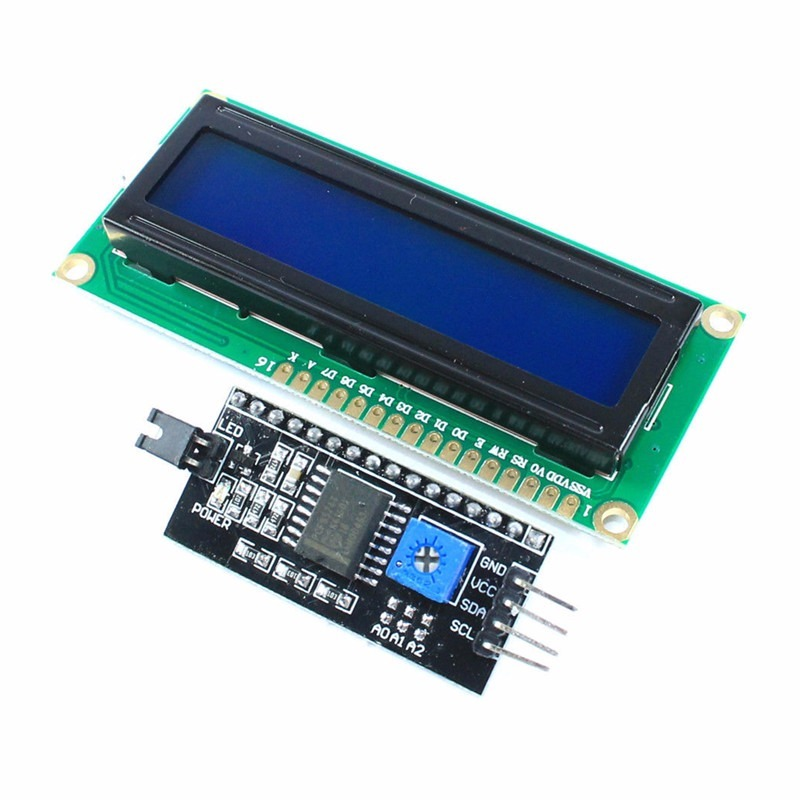
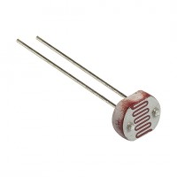
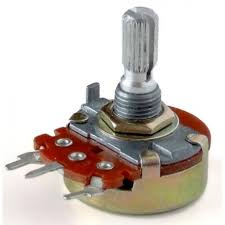
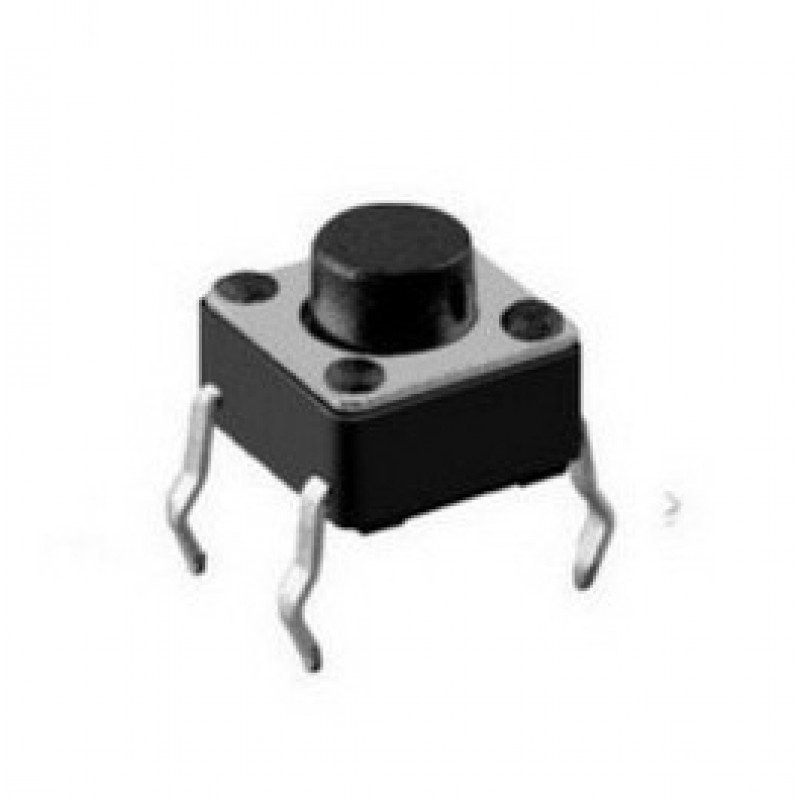
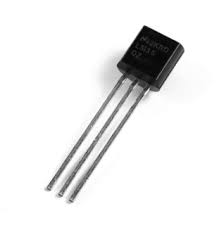
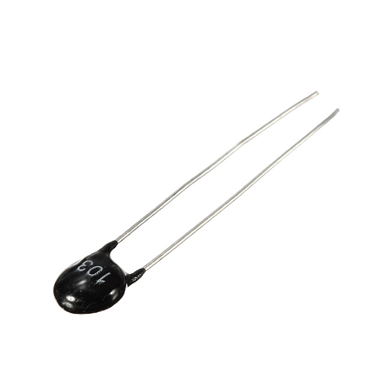
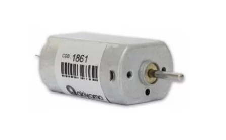
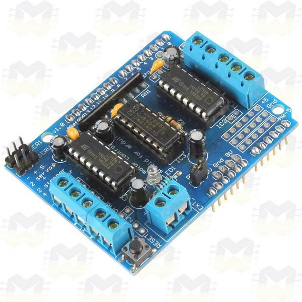
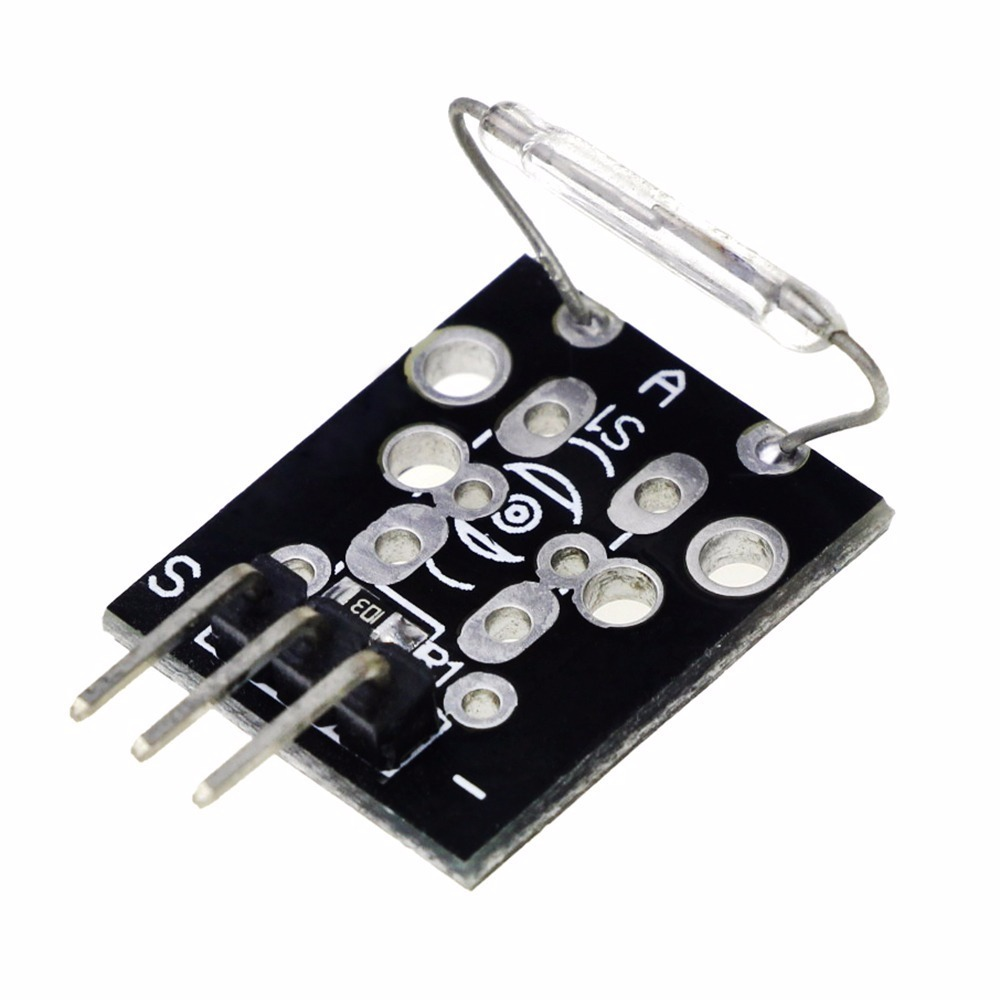

# Material IOT 2020

## Estrutura das aulas
Cada aula vai estar em uma pasta seguindo o padrão `semestre/aula` ter um código de exêmplo,
e também um `README.md` onde terão instruções de como o código funciona. No final de cada readme terá
um ou mais desafios aplicando os conceitos aprendidos.

### Primeiro semestre

É composto por 18 aulas sobre `Arduino` e `C/C++`.

 - Sumário das aulas:

  * `Aula 1 - Arduino, tipos, instalação da IDE.`

  * `Aula 2 - Introdução a lógica de programação.`

  * `Aula 3 - Análise estrutural do sketch usando o blink.`

  * `Aula 4 - Funções do arduino.`

  * `Aula 5 - Variáveis, constantes e definições.`

  * `Aula 6* - O que são tipos.`

  * `Aula 7 - Operações lógicas.`

  * `Aula 8 - Tomando decisões - if, else, else if.`

  * `Aula 9 - Controle de repetição - Loops for e while(e o temido goto).`

  * `Aula 10 - Funções e retornos.`

  * `Aula 11 - Criando nosso primeiro projeto no git.`

  * `Aula 12 - Trabalhando em equipe com git.`

  * `Aula 13 - Switch case e ternários.`

  * `Aula 14 - Entendendo a estrurura de uma lib.`

  * `Aula 15 - Convertendo tipos.`

  * `Aula 16 - Arrays e estruturas de dados.`

  * `Aula 17 - Criando nossa lib parte 1, header.`

  * `Aula 18 - Criando nossa lib parte 2, body.`

### Segundo semestre

É composto por 14 aulas sobre `Python` e `Raspberry Pi` no Virtual Box.

 - Sumário das aulas:

  * `Aula 1 - Introdução ao raspberry pi e dispositivos de borda.`

  * `Aula 2 - Configuração inicial e comandos administrativos.`

  * `Aula 3 - Introdução a Python.`

  * `Aula 4 - Variáveis e a falta de tipos no python.`

  * `Aula 5 - Decisões e controles de repetição no python.`

  * `Aula 6 - Funções no python.`

  * `Aula 7 - Introdução a programação orientada a objetos.`

  * `Aula 8 - Libs em python - pip, gpio.`

  * `Aula 9 - Integração Arduino e Rasp, comunicação serial.`

  * `Aula 10 - APIs e requests http.`

  * `Aula 11 - Usando o docker na infraestrutura.`

  * `Aula 12 - Time series databases, Introdução ao influx.`

  * `Aula 13 - Introdução a monitoramento com Grafana.`

  * `Aula 14 - Fazendo pequenas API's REST com sinatra.`

## Hardware

Para um melhor acompanhamento das aulas é sugerido que tenha em mão os seguintes itens:

* `Arduino Uno`

* `Cabo serial para arduino`

* `Fonte bivolt 9V/1A com plug P4`

* `LCD 16x2 Com Interface I2C`

* `Sensor ultrassônico - HC-SR04`

* `Sensor de umidade e temperatura - DHT11`

* `Sensor de Luminosidade LDR 5mm`

* `Potenciômetro de 1K`

* `Módulo Relé 5V`

* `Chaves Táctil 4 terminais PushButton (4 unidades)`

* `Sensor de Temperatura LM35DZ`

* `Sensor de Temperatura NTC 10K 5mm`

* `Micro Servo 9g SG90 TowerPro`

* `Motor DC 5V`

* `Ponte H L293D`

* `Protoboard 830 pontos`

* `Kit RFID Sensor e cartão/tag - RFID-RC522`

* `Solenoide`

* `Chave Magnética Reed Switch - KY-021`

* `Leds`

  - 5 LEDs Amarelos
  - 5 LEDs Vermelhos
  - 5 LEDs Verdes
  - 5 LEDs Azuis
  - 5 LEDs Brancos
  - 3 LED RGB Alto Brilho 4 Terminais Ânodo Comum

* `Resistores`

  - 25 Resistores de 300Ω
  - 10 Resistores de 220Ω
  - 10 Resistores de 10KΩ

* `Jumpers`

  - 40	 Jumpers Premium Macho / Macho
  - 10	 Jumpers Premium Fêmea / Fêmea
  - 10	 Jumpers Premium Macho / Fêmea

