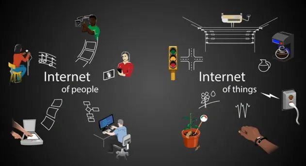
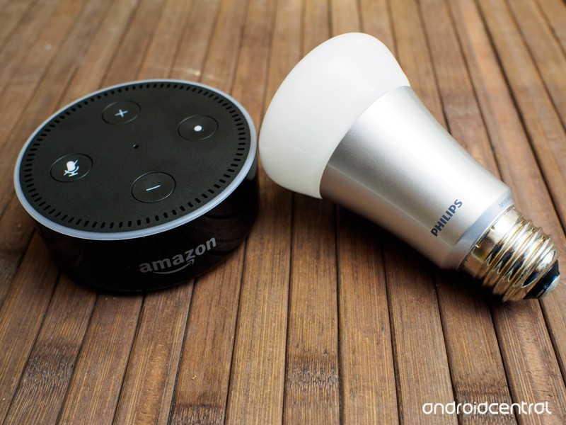
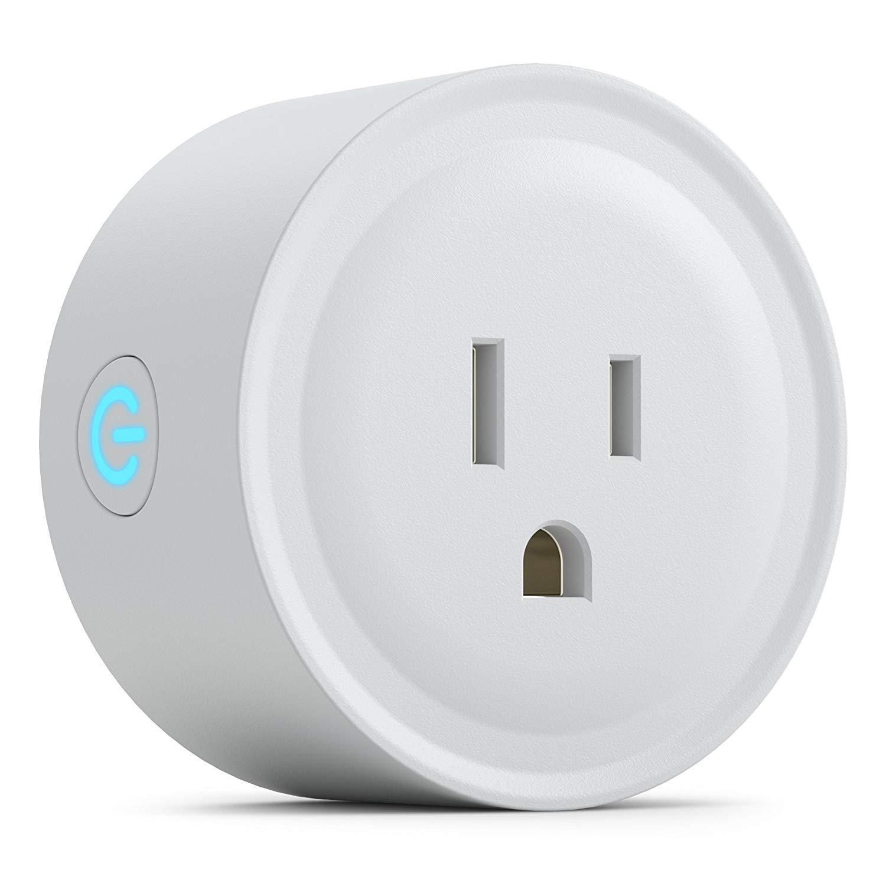
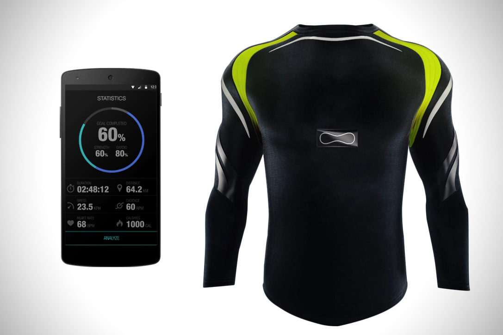
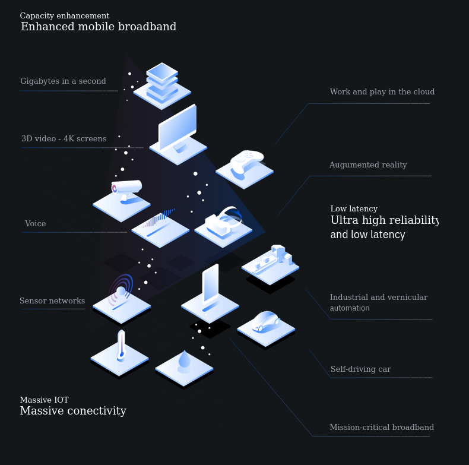

# Aula 1 - O que é IOT?

## Conteúdo

### Introdução

`IOT` significa `Internet Of Things` ou `Internet das coisas` em portugues. E ele eh basicamente um termo que descreve um sistema de dispositivos do nosso dia-a-dia capazes de coletar metricas e transmiti-las sem a necessidade de uma interacao manual. Para isso eh utilizado sensores e outros componentes eletronicos para manipular e automatizar outros aparelhos eletronicos, gerar alertas, e tambem coletandar dados para analisa-los.

Diferente da internet convencional feita para pessoas, essa internet das coisas como o nome mesmo diz, eh uma internet feita para dispositivos interagirem com outros dispositivos, isso eh feito usando sensores, meios de transmicao e muitas outras tecnologias.

### O ouro do IOT

Para muitos, o ouro do IOT sao os dados. O IOT vai bem alem de apens coletar dados, mas essa parte eh crucial para varias coisas, desde ter uma tomada de decisao mais segura, ou para tentar entender melhor com algo desconhecido que estamos lidando, e os dados sao coisas que podem ter um grande impacto comercial.

Mas devemos tomar cuidado, pois nao eh qualquer dado que eh importante, pelo contrario, muitos dos dados serao inuteis, por isso eh importante entender o que voce deseja analisar para enfim coletar os dados corretos!

Muitas pessoas falam que o ouro do IOT sao os dados, pois eles podem trazer novos pontos de vista que nao conheciamos antes.

### Aplicacoes reais

IOT ja eh bem usado no nosso dia-a-dia. Alguns exemplos sao:

* [Carros com sensores que podem ate evitar multas](https://youtu.be/bn1uzAJk-6o)

* Smarthouses controladas por algum assistente como alexa, google assistent ou siri.

* Tomadas inteligentes que permitem ligar qualquer dispositivo a internet.

* [Roupas com tecnologia](https://hiconsumption.com/dynafeed-smart-shirt/)

* [Automacao e melhorias na agro-pecuaria](https://internetofbusiness.com/john-deere-turns-iot-smart-farming/)

* Entre muitos outros...

Imagine o seguinte exemplo, alguem com um smartwatch esta dormindo, enquanto isso seu relogio coleta metricas sobre a saude e sono dessa pessoa e envia para o seu smartphone para que seja analisado. Durante uma dessas analises foi visto que a pessoa estava com a pressao alta, e com batimentos cardiacos acelerados, ao detectar essa anomalia seu celular envia um pedido de ajuda para o SAMU, enquanto o SAMU esta a caminho, eles ja receberam seus detalhes medicos para saber como tratar de voce, se tu tem alguma alergia ou nao, etc.

### O que vamos construir?

Durante esse ano faremos alguns protótipos em grupos, neles testaremos algumas coisas diferentes durante o ano. No primeiro semestre construiremos nosso gadget, o despositivo em si, e no segundo semestre falaremos mais sobre maneiras de fazer a integração dele com outros servicos na nuvem para processar esses dados.

## Desafios tecnologicos

Com o avanco da computacao em nuvem o IOT evoluiu bastante, existem milhares de servicos para iot nas grandes empresas de cloud. Mas ainda temos alguns desafios como conexão com a Internet principalmente, onde ainda eh muito usado o IPv4, porem com uma crescente quantia de dispositivos esses enderecos vao acabar em breve, o que vai nos fazer migrar em breve para o IPv6. Fora isso tambem ainda nao temos velocidades muito altas para Internet movel, outra coisa que deve progredir muito com o avanco do 5G.

Outra grande preocupacao eh com a seguranca, pois como falamos no exemplo acima, imagine que seu historico medico seja publicado na internet, isso nao seria muito legal ne? Entre as maiores preocupacoes com seguranca podemos citar a privacidade dos dados, ou anonimato deles caso publicados(por exemplo o [Google Flu Trends](https://en.wikipedia.org/wiki/Google_Flu_Trends), ele te diz onde as pessas estao procurando termos relacionados a gripe, mas nao falava quem eh o usuario), tambem temos dispositivos que muitas vezes tem uma certa dificuldade para realizar atualizacoes remotas, seguranca fisica e muitas outras.

Esses e outros avancos que permitirao que a industria 4.0 realmente se tornar algo mais difundido de maneira geral e aplicavel. Caso queira saber mais sobre a industria 4.0, [leia isso](http://www.industria40.gov.br/).

### Tasklist

Faca um grupo de ate cinco pessoas, ele sera seu grupo para os trabalho. Cada grupo deve escolher um problema que pode ser resolvido ou analisado usando IOT e traga para discussão na proxima aula.

* [ ] Descrever um problema que poderia ser resolvido/analisado com IOT.

## Referências e recursos úteis

[What is the Internet of Things? And why should you care? | Benson Hougland | TEDxTemecula](https://www.youtube.com/watch?v=_AlcRoqS65E)

[Top IoT Security Risks](https://www.intellectsoft.net/blog/biggest-iot-security-issues/#)

[5G revolution - IBM](https://www.ibm.com/industries/telecom-media-entertainment/resources/5g-revolution/)

[Gartner IOT trends 2018](https://www.gartner.com/en/newsroom/press-releases/2018-11-07-gartner-identifies-top-10-strategic-iot-technologies-and-trends)

[IPV6 role in IOT](https://www.perle.com/articles/what-ipv6-means-for-iot-networking-40183050.shtml)
