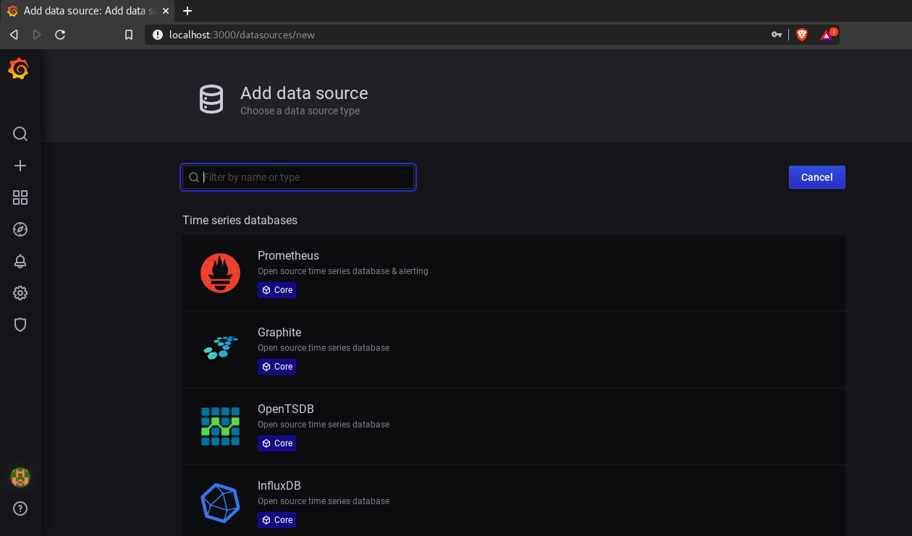
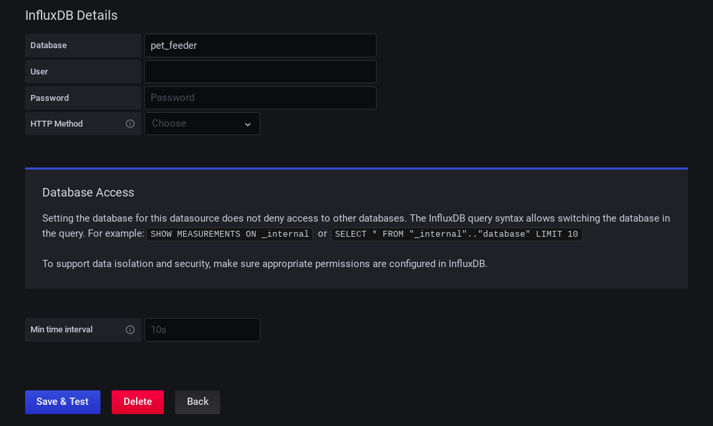
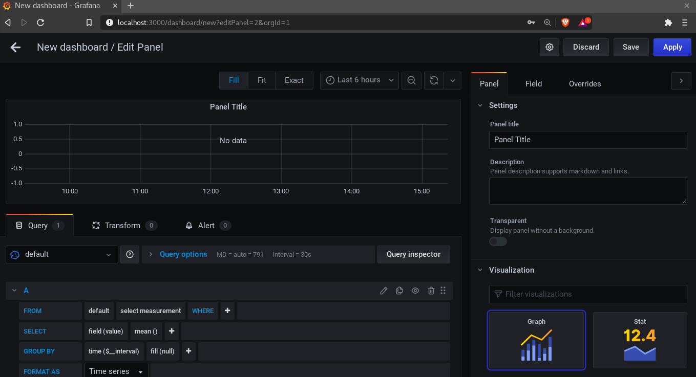
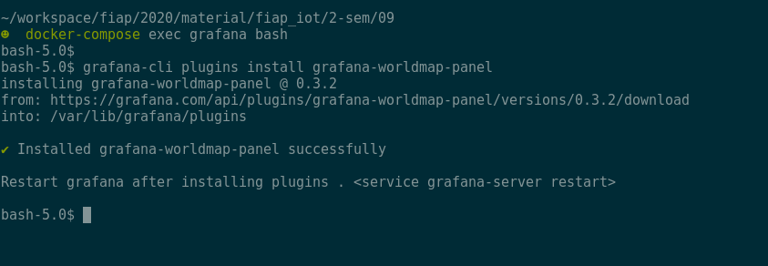

# Aula 9 - Introdução à monitoração com Grafana.

## Conteúdo

### Intro

O Grafana é um software livre para a criação de dashboards web, ele tem muitas features bacanas nele como a fácil conexão com grande parte dos bancos de dados existentes, criação de alertas, manilupalção de dados para criar tabelas e gráficos, entre diversas coisas.
Ao instalarmos o grafana ou subirmos um container e acessarmos o endereço dele nos será solicitado um login. Entre com o login inicial que é `admin:admin`, agora antes de mais nada, precisamos entender o que é um data source.

### Data Source

Um data source é de onde vem nossos dados, qual a fonte que vamos pegar os dados, podem ser bancos de dados como mysql, InfluxDB, entre outros. Atualmente os datasources suportados são: AWS CloudWatch, Azure Monitor, Elasticsearch, Google Stackdriver, Graphite, InfluxDB, Loki, Microsoft SQL Server (MSSQL), Mixed, MySQL, OpenTSDB, PostgreSQL, Prometheus, Testdata.
Porém caso queira usar algum que não tenha sido listado aqui, como o mongoDB por exemplo, o grafana conta com plugins que podem nos ajudar a fazer essa conexão.

Procure no menu a opção datasources e selecione o tipo que deseja criar, coloque a URL e adicione as informaçõoes de acesso. Caso esteja tudo certo quando salvar aparecerá uma mensagem informando que o datasource funciona.
Depois de criar um datasource podemos criar nosso dashboard. A primeira coisa é escolher um tipo de visualisação, os mais usados são gráficos, tabelas, e singlestat(que mostra apenas um dado, e.g. numero de contas ativas). Porém temos outros tipos que já vem no grafana e outros que podem ser adicionados por meio de plugins, como um mapa mundi por exemplo.
Ao escolher por exemplo o gráfico, temos que selecionar qual datasource usaremos nele e ajustar as queries para pergarmos os valores que queremos.

Acesse o menu lateral -> Configuracoes -> Data Sources:

Nessa tela aparecerá os datasources caso tenha algum, clique em add data sources para criar uma nova conexão:


Aqui voce vai ter varias opcoes de datasources suportados, no nosso caso vamos escolher o InfluxDB:



Coloque o nome do host e a porta default 8086, como o container se chama influxdb e o grafa esta em outro container rodando passamos o nome dele, caso ele estivesse rodando na sua maquina seria localhost no lugar:


Aqui colocamos o nome do banco que queremos usar, no caso criamos o pet_feeder entao usaremos ele, caso tenha configurado usuario e senha, que nao eh nosso caso aqui eles iriam nessa parte:



Apos verificar que esta tudo ok podemos clicar em salvar e testar, se voce ver essa faixa verde significa que deu tudo certo e o datasource foi criado com sucesso.


### Dashboards

Antes de criarmos nosso dashboard mesmo, seria legal ter alguns dados em nosso datasource, para simular dados de um sensor podemos rodar o seguinte script no nosso terminal para ficar enviando metricas para nossa API:

```bash
while true; do
  curl -H "Content-Type: application/json" -d '{"presence": 0}' http://127.0.0.1/api/v1/metric -v
  sleep 1
  curl -H "Content-Type: application/json" -d '{"presence": 1}' http://127.0.0.1/api/v1/metric -v
done
```

Para criarmos um dashboard clicamos no sinal de mais -> Dashboard.


Em um dashboard podemos mostrar os mesmos dados de varias maneiras diferentes, primeiro vamos criar um novo painel, nesse painel podemos ter varios metodos de visualizacao:



Mas antes de visualizarmos os dados precisamos criar uma query para buscar os dados que nos interessam, o grafana oferece um editor de query que nos ajuda a confirgurar o que precisamos como voce pode ver na imagem acima, podemos pegar as metricas do nosso pet da seguinte maneira:


Observem que usamos as tags para fazer nosso select e o field para pegar o valor do campo, eh muito importante entender como o dado deve ser mostrado, no inicio ele tenta selecionar os dados e aplicar uma media por padrao usando o mean, observem que mudamos para count, pois queremos saber o numero de ocorrencias que tivemos nesse sensor, tambem colocamos para agrupar por tempo e preenchendo os espacoes em branco sem metricas com o valor da metrica anterior, dessa maneira nosso grafico fica mais continuo e mais facil de ler do que se tivesse varios picos. Tambem alteramos o nome e descricao do dashboard.

Apos clicar em apply seu dashboard vai deve parecer um pouco com isso:


Caso queria ver os dados de outras maneiras tambem podemos mudando o tipo de visualisação, vamos criar um novo painel para mostrar essas metricas de uma maneira diferente, clique no botao de adicionar painel ao lado do botao de salvar, aproveite para salvar o dashboard tambem! ;)


### Usuarios e time

Eh possivel e recomendado que se crie times e usuarios separados para cada pessoa, e que essas pessoas tenham acesso apenas aos dashboards do time dela para que todo mundo nao precise usar o usuario admin.

Podemos criar usuarios individuais:


E times que funcionam como grupos para colocar nossos usuarios que terao acesso aos paineis.


### Exportando nossos dashboards

Depois de criar e salvar tudo, uma coisa que pode ser bem útil é exportar o JSON daquela dashboard, isso nos permite reconstrui-la rapidamente, e alterar os campos de uma maneira direta. Para fazer isso abra sua dashboard e vá em settings e procure por `JSON model`. Só salvar e caso queira subir um dashboard com os mesmos datasources e alertas é só importar esse JSON.


### Plugins

Existem diversos plugins que podem nos ajudar a resolver alguns problemas especificos, recomendo sempre procurar se tem algum plugin que resolva o seu problema caso o grafana por si so nao consiga, um exemplo disso eh o plugin para mongoDB, que o grafana nao oferece suporte por padrao. Podemos procurar por plugins e ver quais temos instalados no menu de configuracoes:


Caso nao encontre o que esta procurando olhe no site oficial do grafana para ver mais opcoes, por exemplo o plugin wordmap para criar graficos em forma de mapas, podemos acha-lo no site:

https://grafana.com/grafana/plugins/grafana-worldmap-panel

Clicando na aba install ele mostra como instalar esse plugin, a maioria sao comando simples como esse:


Agora acessamos nosso container, rodamos esse comando e reiniciamos nossos containers:



Se tudo deu certo esse plugin deve aparecer na lista dos seus plugins instalados:


Agora as suas funcoes ja estarao disponiveis na hora de confirgurar um novo painel.

Na proxima aula veremos em detalhes com trabalhar com alertas, ate la!

## Referências e recursos úteis

[Docs Grafana](https://grafana.com/docs/)
